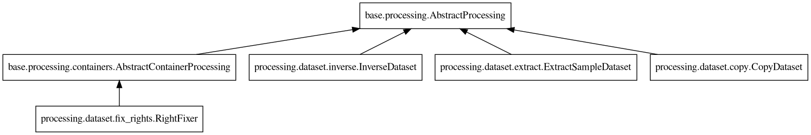
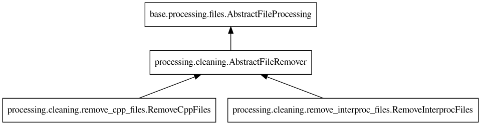
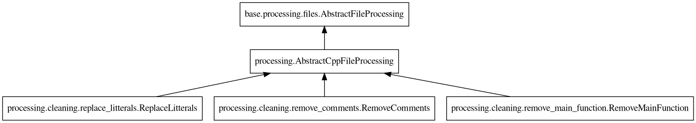
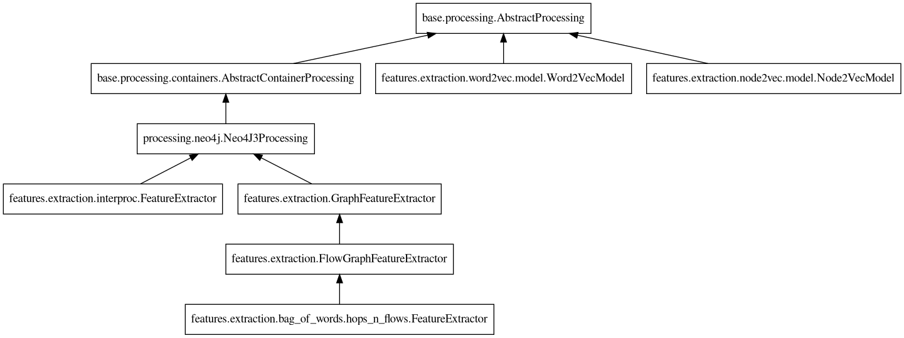
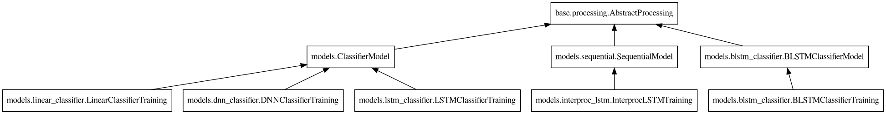

Designing pipelines
===================

1. Design overview
------------------

All pipelines are designed with the same philosophy, illustrated by the following
figure.

.. image:: _static/img/pipeline.png
   :align: center

Assuming that the dataset is correctly organized in classes (the download scripts
provided should take care of it), the steps to produce a viable classifier are the
following:

* Process the dataset
    * Clean the dataset from any items that cannot or should not be parsed.
    * Create intermediate representations by parsing the code with external tools
      (Joern) or models (Word2Vec).
    * Enhance the intermediate representations by linking or annotating them.
* Extract the features
    * Select an extraction algorithm that will output the features in a CSV
      file. Assuming that ``n`` features are extracted and the dataset contains
      ``m`` samples, reloading the CSV file using pandas should create a DataFrame
      of shape ``(m,n+2)``.
    * Reduce the number of features by running one or several feature selectors
      on the dataset. This step will fasten the training of the model but might
      hinder further explainability steps.
* Train the model
    * Choose a model type (fully connected, reccurrent, etc.) fit for the extracted
      features and train it with the processed dataset.
* Evaluate the model
    * Run the model against unseen samples to see if the model can generalized what
      has been learned.

2. From prototype to release
----------------------------

To start designing a pipeline, it is advised to use Jupyter notebooks. Jupyter notebooks
allow for fast prototyping by letting the user to inspect the variables created at each
step and run these steps several time in a row. Some examples are available in the
`notebooks <https://gitlab.nist.gov/gitlab/samate/ai-bugfinder/-/tree/master/notebooks>`__
folder.

Once the notebook runs seemlessly, the code can be bundle into a Python script (see
the `scripts <https://gitlab.nist.gov/gitlab/samate/ai-bugfinder/-/tree/master/scripts>`__
folder for more examples). With the help of ``argparse``, the script can be made
versatile. In addition, wrapping the Python script in a bash script allows to
take care of dependency management that might not be straightforward for all users.

Few pipelines examples are documented `here <https://samate.ipages.nist.gov/ai-bugfinder/examples.html>`__
to help you get started.

3. Available processing
-----------------------

Here are the processing already integrated to the codebase and available when
designing new pipelines. If a processing needs to be fixed or added, please
`create an issue <https://gitlab.nist.gov/gitlab/samate/ai-bugfinder/-/issues>`__.
To create new processing classes, see `Designing processing classes <processing.html>`__.

3.1. Dataset utilities
~~~~~~~~~~~~~~~~~~~~~~

The dataset utility classes manipulate entire datasets for duplication or
slicing:

* :py:class:`bugfinder.processing.dataset.copy.CopyDataset`
* :py:class:`bugfinder.processing.dataset.extract.ExtractSampleDataset`
* :py:class:`bugfinder.processing.dataset.inverse.InverseDataset`
* :py:class:`bugfinder.processing.dataset.fix_rights.RightFixer`

3.2. Dataset processing
~~~~~~~~~~~~~~~~~~~~~~~

One of the first step to process the dataset is to perform cleaning task on the data.
Generic utilities have been implemented for cleaning files:

* :py:class:`bugfinder.processing.cleaning.remove_cpp_files.RemoveCppFiles`
* :py:class:`bugfinder.processing.cleaning.remove_interproc_files.RemoveInterprocFiles`

And other utilities are specifically designed to handle C/C++ code:

* :py:class:`bugfinder.processing.cleaning.remove_main_function.RemoveMainFunction`
* :py:class:`bugfinder.processing.cleaning.replace_litterals.ReplaceLitterals`
* :py:class:`bugfinder.processing.cleaning.remove_comments.RemoveComments`

The rest of the utilities are specific to the type of pipeline to apply and the model to
train. See :doc:`./examples/index` for more insights on the types of processing to use.

* :py:class:`bugfinder.processing.neo4j`
* :py:class:`bugfinder.processing.joern`
* :py:class:`bugfinder.processing.ast`
* :py:class:`bugfinder.processing.tokenizers`
* :py:class:`bugfinder.processing.interproc`
* :py:class:`bugfinder.processing.sink_tagging`

3.3. Feature extraction
~~~~~~~~~~~~~~~~~~~~~~~

Once the dataset is prepared, feature extraction can happen. Since different models need
different features, the bugfinder has several feature extraction method available:

* :py:class:`bugfinder.features.extraction.bag_of_words.hops_n_flows`
* :py:class:`bugfinder.features.extraction.word2vec.model`
* :py:class:`bugfinder.features.extraction.node2vec.model`
* :py:class:`bugfinder.features.extraction.interproc`

3.4. Feature reduction
~~~~~~~~~~~~~~~~~~~~~~

Depending on the feature extractor chosen, it is possible to end up with many features,
impacting training time and convergence of the model. To remediate, several feature
reduction algorithms are packaged, all inheriting from
:py:class:`bugfinder.features.reduction.AbstractFeatureSelector`.

* :py:class:`bugfinder.features.reduction.auto_encoder`
* :py:class:`bugfinder.features.reduction.pca`
* :py:class:`bugfinder.features.reduction.recursive_feature_elimination`
* :py:class:`bugfinder.features.reduction.select_from_model`
* :py:class:`bugfinder.features.reduction.sequential_feature_selector`
* :py:class:`bugfinder.features.reduction.univariate_select`
* :py:class:`bugfinder.features.reduction.variance_threshold`

3.5. Models
~~~~~~~~~~~

Once the feature extraction and reduction is done, the model can be trained. Several
classifiers are available:

* :py:class:`bugfinder.models.linear_classifier`
* :py:class:`bugfinder.models.dnn_classifier`
* :py:class:`bugfinder.models.lstm_classifier`
* :py:class:`bugfinder.models.blstm_classifier`
* :py:class:`bugfinder.models.interproc_lstm`

