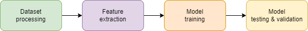

Introduction
============

Disclaimer
----------

This installation has been tested on Ubuntu 20.04LTS systems. The commands
listed in this file should be adapted depending on the system used.

1. Pre-requisites
-----------------

1.1. System dependencies
~~~~~~~~~~~~~~~~~~~~~~~~

-  APT packages (using ``apt-get install ${pkg_name}``):

   -  unzip
   -  parallel

-  Docker: https://docs.docker.com/install/#supported-platforms
-  Docker-compose: https://docs.docker.com/compose/install/
-  Python >= 3.9: https://www.python.org/downloads/

1.2. Pipenv
~~~~~~~~~~~

Using ``pipenv`` is the recommended way to manage the necessary Python
dependencies. To set up the environment with ``pipenv``, use the following
commands:

.. code-block:: bash

    pip install -U pipenv
    pipenv install --dev  # --dev is optional and installs dev dependencies.
    pipenv shell

1.3. Virtual environments
~~~~~~~~~~~~~~~~~~~~~~~~~

Other virtual environment solutions can also be used:

-  With ``venv``: https://virtualenv.pypa.io/en/stable/installation/
-  With ``conda``: https://conda.io/docs/user-guide/install/index.html

Once the Python environment is setup and the repository downloaded, run:

.. code-block:: bash

    pip install -r requirements.txt
    pip install -r requirements.dev.txt  # Optional, installs dev dependencies.

2. Installation
---------------

2.1. Download the datasets
~~~~~~~~~~~~~~~~~~~~~~~~~~

There are several datasets  to choose from:

* The CWE-121 is a set of buffer overflow test cases (2838 buggy test cases,
  2838 clean test cases). It is a good place to begin the exploration of this
  repository. Download it by typing ``./scripts/download_cwe121.sh``.
* The `Juliet Dataset for C/C++ <https://samate.nist.gov/SRD/testsuite.php>`__
  is a much larger dataset containing multiple types of bugs. It can be
  downloaded with ``./scripts/download_juliet.sh`` and contains 64099 buggy
  test cases and 64099 clean test cases.
* A better dataset, focused on buffer overflows, is packaged with this
  repository. It contains 6507 buggy test cases and 5905 clean test cases and
  can be installed using ``./scripts/setup_ai_dataset.sh``. More information
  about this dataset is avaible at
  https://gitlab.nist.gov/gitlab/samate/ai-dataset/.

2.2. Build the docker images
~~~~~~~~~~~~~~~~~~~~~~~~~~~~

The necessary docker images can be built using *docker-compose*. Run the
following command to build them:

.. code-block:: bash

    cd images
    docker-compose build

Four images should be built:

- *joern-lite:0.3.1*: Latest release of Joern (11/21/2011).
- *joern-lite:0.4.0*: Latest code update from Joern (04/12/2017).
- *neo4j-ai:latest*: Neo4J v3 image package with additional shell tools.
- *right-fixer:latest*: Tool to modify rights of a given folder.

2.3. Run the tests (optional)
~~~~~~~~~~~~~~~~~~~~~~~~~~~~~

Substantial tests have been developed to ensure the code is working properly.
To run the tests, use ``pytest ./tests``. While no error should occur upon
running the tests, some warnings may appear.

*Note: The development dependencies need to be installed to run these tests.*

3. Usage
--------

3.1. Pipeline design
~~~~~~~~~~~~~~~~~~~~

The tool and dataset now ready, a processing pipeline needs to be designed.
While pipelines will vary depending on the datasets and models to be used, it
will always be organized as such:

- Dataset processing mainly revolves around cleaning, parsing and annotating
  the dataset.
- Feature extraction consists in building a set of CSV files containing
  properties (features) of each item of the dataset.
- Model training uses the CSV files as input to train the weights of the model.
- Model testing and validation evaluates the model performance on unseen
  samples of the dataset.

3.2. Processing steps
~~~~~~~~~~~~~~~~~~~~~

For each pipeline stage previously described, several processing steps have
been implemented. This repository offers two ways of creating pipelines:

- **Jupyter notebooks**, presenting code samples for the various operations to be
  performed. Users can use the code snippets provided to design their own
  pipelines in the form of a Python script. A code sample for a Python
  pipeline is avaiable at `<_static/scripts/sample.py>`_.

.. include:: _static/scripts/sample.py
    :code: python

- **Python scripts**, to directly manipulate the dataset, extract features and
  train models to identify bugs in the source code. The commands to run the
  pipelines can be bundled in shell scripts. The same example as
  before, using the python scripts is available at 
  `<_static/scripts/sample.sh>`_.

.. include:: _static/scripts/sample.sh
    :code: bash

